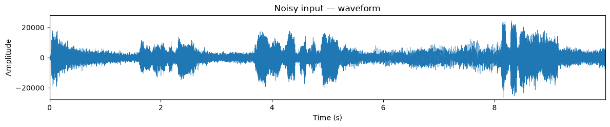
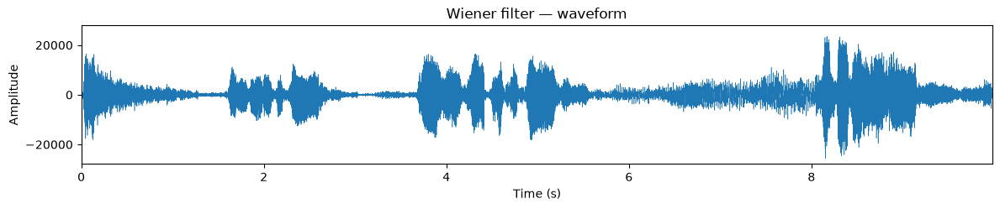
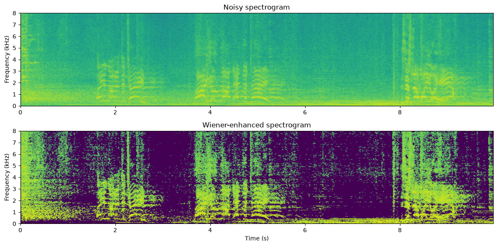
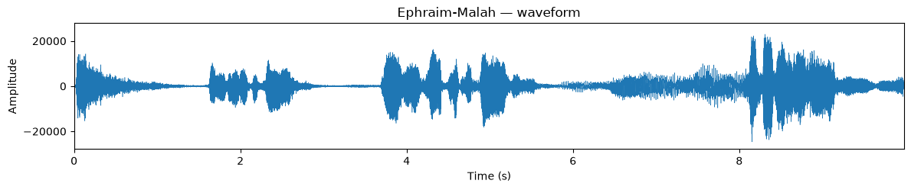
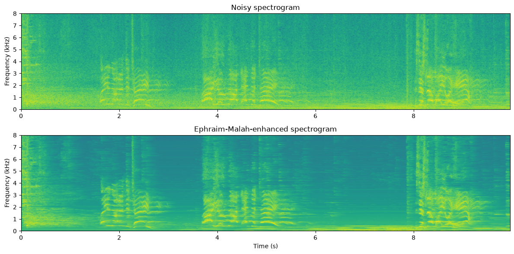
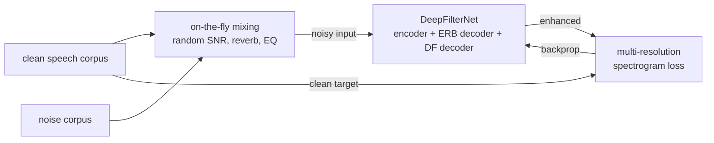
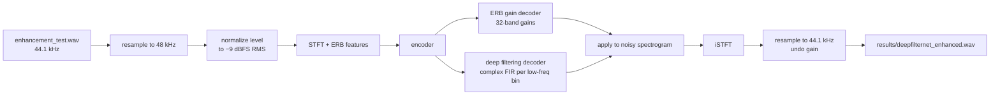
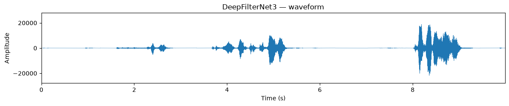
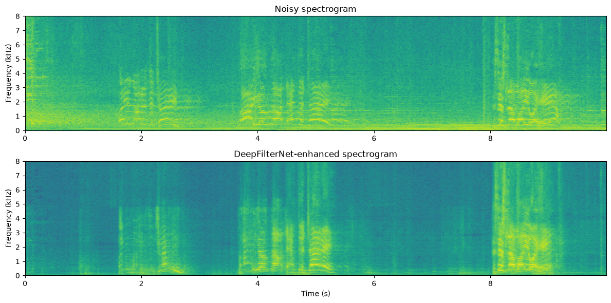

# Noise Attenuation

**🔊 [Listen to all results online](https://cozec.github.io/noise_attenuation/)** —
a demo page with inline audio players for every method (the ▶ links below open
GitHub's file viewer instead, since GitHub strips audio players from READMEs).

## What is noise attenuation?

Speech recorded in the real world is rarely clean — it arrives mixed with
background noise (traffic, babble, fans, wind). *Noise attenuation* (speech
enhancement) tries to recover the clean speech from a single noisy recording.
The classical approach works in the time-frequency domain: slice the signal
into short overlapping frames (STFT), estimate how much of each
time-frequency bin is noise, multiply each bin by a suppression gain between
0 and 1, and resynthesize with the inverse STFT. The methods differ in **how
the gain is computed**; modern neural methods replace the hand-derived gain
rule with a learned network.

This repo implements and compares four methods on the same noisy test signal,
following the Aalto Speech Processing Book chapter
[Noise attenuation](https://speechprocessingbook.aalto.fi/Enhancement/Noise_attenuation.html):

| # | Method | Type | Gain rule |
|---|---|---|---|
| 1 | Spectral subtraction | classical | magnitude-domain power subtraction |
| 2 | Wiener filter | classical | MMSE-optimal linear power ratio |
| 3 | Ephraim–Malah | classical | MMSE spectral amplitude, decision-directed |
| 4 | DeepFilterNet3 | neural (pretrained) | learned ERB gains + deep filtering |

## The test signal

Speech in noise, 10 s at 44.1 kHz (`audio/noisy_input.wav`):

[▶ Play noisy input](audio/noisy_input.wav)



The three classical scripts are fully self-contained (load audio → STFT →
noise estimation → gain → ISTFT → WAV + plots) and share the same front end:
30 ms half-sine windows with 15 ms hop, 2048-point zero-padded FFT, and a
noise model `N(k)` estimated by averaging the power spectra of low-energy
frames (a simple energy VAD: frames more than 3 dB below the mean frame
energy are taken as noise-only).

```bash
python3 -m venv .venv
.venv/bin/pip install numpy scipy matplotlib
.venv/bin/python src/spectral_subtraction.py   # -> results/spectral_subtraction_enhanced.wav
.venv/bin/python src/wiener_filtering.py       # -> results/wiener_enhanced.wav
.venv/bin/python src/ephraim_malah.py          # -> results/ephraim_malah_enhanced.wav
```

## 1. Spectral subtraction — `src/spectral_subtraction.py`

The oldest and simplest approach: subtract the noise power estimate from the
noisy power spectrum and rescale the magnitude accordingly.

```
G = sqrt( max(|Y|² − N, 0) / |Y|² )
```

The `max(·, 0)` threshold is needed because the noise estimate is an average —
in any single frame the actual noise can exceed it, making the difference
negative. Those randomly zeroed bins are what cause the characteristic
"musical noise" (isolated warbling tones) in the output.

[▶ Play spectral subtraction output](audio/spectral_subtraction_enhanced.wav)


## 2. Wiener filter — `src/wiener_filtering.py`

The minimum mean-square error solution for a linear filter. Same subtraction,
but the gain is the ratio of estimated speech power to noisy power **without**
the square root:

```
G = max(|Y|² − N, 0) / |Y|²
```

Since `G ≤ 1`, omitting the square root makes the gain smaller — the Wiener
filter suppresses noise more aggressively than spectral subtraction at the
same SNR, at the price of slightly more speech attenuation. Both methods are
memoryless: each frame is processed independently, so musical noise remains.

[▶ Play Wiener filter output](audio/wiener_enhanced.wav)





## 3. Ephraim–Malah — `src/ephraim_malah.py`

The MMSE short-time spectral amplitude estimator (Ephraim & Malah, 1984).
Instead of a simple power ratio, it computes the statistically optimal
amplitude estimate assuming Gaussian speech and noise spectra, using two SNR
quantities per bin:

```
gamma = |Y|² / N                                   (a posteriori SNR)
xi    = alpha·A²ₚᵣₑᵥ/N + (1−alpha)·max(gamma−1,0)  (a priori SNR, decision-directed)
v     = xi·gamma / (1 + xi)
G     = (√pi/2)·(√v/gamma)·e^(−v/2)·[(1+v)·I₀(v/2) + v·I₁(v/2)]
```

`I₀, I₁` are modified Bessel functions, and `A_prev = G·|Y|` is the previous
frame's amplitude estimate, smoothed in with `alpha = 0.98`
("decision-directed" rule). That temporal recursion is the key difference from
the two methods above: the gain evolves smoothly over time instead of jumping
frame to frame, which strongly reduces musical noise. An a priori SNR floor of
−25 dB bounds the maximum suppression.

[▶ Play Ephraim–Malah output](audio/ephraim_malah_enhanced.wav)





## 4. DeepFilterNet (neural, pretrained) — `src/deepfilternet_test.py`

[DeepFilterNet](https://github.com/Rikorose/DeepFilterNet) (Schröter et al.,
DeepFilterNet3) is a real-time deep-learning speech enhancer operating on
48 kHz audio. Unlike the classical methods above — which apply a real-valued
gain per time-frequency bin — it works in two stages:

1. **ERB-domain gains**: the full band is compressed into 32 perceptual (ERB)
   bands and a recurrent network predicts a gain per band, cheaply shaping the
   overall spectral envelope.
2. **Deep filtering**: for the lower frequencies (where speech harmonics
   live), the network predicts a short *complex* multi-frame FIR filter per
   bin, which can reconstruct phase and recover harmonics buried in noise —
   not just attenuate.

We only run **inference** with the published pretrained checkpoint; training
was done by the authors on large noise-suppression corpora. Both pipelines:

**Training (done by the authors, shown for context):**



**Test / inference (what `src/deepfilternet_test.py` does):**



Note the **level normalization** step: the pretrained DeepFilterNet3
checkpoint degrades badly on quiet inputs — on this file (−19 dBFS RMS) it
suppressed the speech along with the noise. Normalizing the RMS to −9 dBFS
before inference (and undoing the gain afterwards) restores clean speech;
`src/deepfilternet_test.py` does this automatically.

Setup (needs Python ≤ 3.11 for the prebuilt Rust extension):

```bash
python3.11 -m venv .venv-dfn
.venv-dfn/bin/pip install deepfilternet torch==2.1.2 torchaudio==2.1.2 scipy matplotlib
.venv-dfn/bin/python src/deepfilternet_test.py   # downloads the checkpoint on first run
```

[▶ Play DeepFilterNet output](audio/deepfilternet_enhanced.wav)





## Summary

Residual power measured in the VAD-detected noise-only frames of the test
signal (lower = more noise removed):

| Method | Noise-frame power | Character |
|---|---|---|
| Noisy input | 64.1 dB | — |
| Spectral subtraction | 60.2 dB | gentlest, most musical noise |
| Wiener | 58.7 dB | stronger suppression, still musical noise |
| Ephraim–Malah | 55.9 dB | strongest classical, smooth residual |
| DeepFilterNet3 (pretrained) | 40.4 dB | neural, far cleaner residual |

Takeaways:

- The three classical methods form a clear progression: adding the square
  root (spectral subtraction → Wiener) buys ~1.5 dB, and adding temporal
  smoothing of the SNR estimate (Wiener → Ephraim–Malah) buys ~3 dB more
  while suppressing musical noise.
- All classical methods are limited by the same assumption — a stationary
  noise spectrum and a real, per-bin gain — so they cannot remove noise that
  overlaps speech in time and frequency.
- The pretrained DeepFilterNet3 is in a different league (~24 dB noise
  reduction, over 15 dB beyond the best classical method) because it learned
  speech structure from data and filters complex spectra across multiple
  frames, removing noise even underneath the speech.
- The spectral subtraction and Wiener outputs match the book's published
  clips (correlation 0.999; the small deviation is the 2048-point FFT vs. the
  book's window-length FFT).

## Layout

```
audio/                          # playable WAVs referenced by this README
data/
  Noise_attenuation.html        # full rendered chapter page (21 MB, embedded audio)
  sounds/                       # source signals: enhancement_test.wav (44.1 kHz), _16k.wav
  audio_outputs/                # all 20 audio clips embedded in the page (cellNN_clipNN.wav)
src/
  Noise_attenuation.ipynb       # original source notebook
  noise_attenuation_all_code.py # verbatim dump of every code cell
  noise_attenuation_classical.py# runnable duplicate of the chapter's classical pipeline
  spectral_subtraction.py       # standalone method 1
  wiener_filtering.py           # standalone method 2
  ephraim_malah.py              # standalone method 3
  deepfilternet_test.py         # method 4: pretrained DeepFilterNet3 inference
  helper_functions.py           # stft / istft / halfsinewindow / zcr (from repo)
  frontend.py, Enhancer.py      # neural demo support code (from repo)
  models/                       # pretrained weights for the book's neural enhancers
plots/                          # figures (waveforms, spectrograms, noise models)
results/                        # enhanced WAVs regenerated locally (gitignored)
```

Local duplicate of all audio data and code from the chapter
[Noise attenuation](https://speechprocessingbook.aalto.fi/Enhancement/Noise_attenuation.html)
(source repo: [Speech-Interaction-Technology-Aalto-U/itsp](https://github.com/Speech-Interaction-Technology-Aalto-U/itsp), `Enhancement/`).
